# MuayLang - System Architecture Documentation

> **Version**: 1.0.0  
> **Last Updated**: November 2025  
> **Status**: Active Development

---

## 📑 Table of Contents

1. [Overview](#overview)
2. [Architecture Principles](#architecture-principles)
3. [System Layers](#system-layers)
4. [Data Flow](#data-flow)
5. [Security Architecture](#security-architecture)
6. [Technology Decisions](#technology-decisions)
7. [Performance Considerations](#performance-considerations)
8. [Future Improvements](#future-improvements)

---

## 🎯 Overview

MuayLang is a cross-platform mobile application built with React Native and Expo, combining Thai language learning with Muay Thai training tracking. The architecture follows a **layered approach** with clear separation of concerns.

### Key Characteristics

- **Cross-platform**: Single codebase for iOS, Android, and Web
- **Backend-as-a-Service**: Leverages Appwrite for backend operations
- **Type-safe**: TypeScript throughout the codebase
- **Modern State Management**: React Query for server state, Context API for client state
- **File-based Routing**: Expo Router for navigation

---

## 🏗 Architecture Principles

### 1. **Separation of Concerns**

- UI components are separate from business logic
- API layer abstracts backend communication
- Utilities and helpers are modular and reusable

### 2. **Single Source of Truth**

- React Query cache for server data
- UserContext for authentication state
- Appwrite as the authoritative data source

### 3. **Performance First**

- Optimistic updates with React Query
- Lazy loading of routes and components
- Image optimization with Expo Image

### 4. **Developer Experience**

- TypeScript for type safety
- ESLint and Prettier for code consistency
- Hot reload for fast iteration

---

## 📚 System Layers

### 1. **Presentation Layer**

```
app/
├── (auth)/          # Authentication screens
├── (tabs)/          # Main application tabs
├── vocabulary/      # Vocabulary CRUD pages
└── section/         # Training session CRUD pages
```

**Responsibilities:**

- User interface rendering
- User interaction handling
- Route navigation
- Input validation (UI level)

**Technologies:**

- Expo Router (file-based routing)
- NativeWind (Tailwind CSS)
- Gluestack UI components

---

### 2. **State Management Layer**

#### a) Server State (React Query)

```typescript
// Example: useVocabularies hook
const { data, isLoading, error } = useVocabularies(userId)
```

**Responsibilities:**

- API data fetching and caching
- Optimistic updates
- Background refetching
- Error handling

**Key Features:**

- Automatic cache invalidation
- Retry logic
- Loading/error states

#### b) Client State (React Context)

```typescript
// UserContext provides authentication state
const { user, login, logout, loginAsGuest } = useUser()
```

**Responsibilities:**

- User authentication state
- Session management
- Guest mode flag

---

### 3. **Business Logic Layer**

```
lib/
├── learningAPI.ts      # Vocabulary operations
├── trainingAPI.ts      # Training operations
├── learningAppwrite.js # Vocabulary Appwrite SDK
└── traningAppwrite.js  # Training Appwrite SDK
```

**Responsibilities:**

- Data transformation
- Business rules enforcement
- API call orchestration

**Pattern:**

```
Component → Custom Hook → API Function → Appwrite SDK → Backend
```

---

### 4. **Backend Layer (Appwrite)**

**Services Used:**

1. **Authentication**
   - Email/Password sessions
   - Guest sessions (demo account)
   - Email verification

2. **Database**
   - Collections: `vocabularies`, `training`
   - Document-level permissions
   - Real-time subscriptions (planned)

3. **Storage**
   - Training session photos
   - User avatars (planned)

---

## 🔄 Data Flow

### Read Flow (Fetching Data)

```mermaid
%%{init: {'theme':'base', 'themeVariables': { 'primaryColor':'#6B3789','primaryTextColor':'#000','actorBkg':'#E8D5F2','actorBorder':'#6B3789','actorTextColor':'#000','signalColor':'#6B3789','signalTextColor':'#000','labelBoxBkgColor':'#F8B229','labelBoxBorderColor':'#6B3789','labelTextColor':'#000'}}}%%
sequenceDiagram
    participant User as 👤 User
    participant Component as 🎨 Component
    participant ReactQuery as 📦 React Query
    participant API as ⚙️ API
    participant Appwrite as ☁️ Appwrite
    participant Database as 💾 DB

    User->>Component: Opens page
    Component->>ReactQuery: useVocabularies()

    alt Cache exists and fresh
        ReactQuery-->>Component: Return cached data
    else Cache stale or missing
        ReactQuery->>API: getAllVocabularies()
        API->>Appwrite: databases.listDocuments()
        Appwrite->>Database: Query
        Database-->>Appwrite: Results
        Appwrite-->>API: Documents
        API->>API: Transform data
        API-->>ReactQuery: Processed data
        ReactQuery->>ReactQuery: Update cache
        ReactQuery-->>Component: Return data
    end

    Component->>Component: Render UI
    Component-->>User: Display data
```



### Write Flow (Updating Data)

```mermaid
%%{init: {'theme':'base', 'themeVariables': { 'primaryColor':'#6B3789','primaryTextColor':'#000','actorBkg':'#E8D5F2','actorBorder':'#6B3789','actorTextColor':'#000','signalColor':'#6B3789','signalTextColor':'#000','labelBoxBkgColor':'#F8B229','labelBoxBorderColor':'#6B3789','labelTextColor':'#000'}}}%%
sequenceDiagram
    participant User as 👤 User
    participant Component as 🎨 Component
    participant ReactQuery as 📦 React Query
    participant API as ⚙️ API
    participant Appwrite as ☁️ Appwrite
    participant Database as 💾 DB

    User->>Component: Edit vocabulary
    Component->>ReactQuery: updateMutation.mutate()

    ReactQuery->>ReactQuery: Optimistic update
    ReactQuery->>API: updateVocabulary()
    API->>Appwrite: databases.updateDocument()
    Appwrite->>Database: UPDATE
    Database-->>Appwrite: Success
    Appwrite-->>API: Updated document
    API-->>ReactQuery: Updated data
    ReactQuery->>ReactQuery: Invalidate cache
    ReactQuery->>ReactQuery: Refetch queries
    ReactQuery-->>Component: Success callback
    Component-->>User: Show success
```



---

## 🔐 Security Architecture

### Authentication Strategy

```mermaid
%%{init: {'theme':'base', 'themeVariables': { 'primaryColor':'#6B3789','primaryTextColor':'#fff','primaryBorderColor':'#4B0082','lineColor':'#F8B229','secondaryColor':'#FF6B6B','tertiaryColor':'#4ECDC4'}}}%%
graph TD
    A[👤 User] --> B{Session Check}
    B -->|No Session| C[🔐 Redirect to Auth]
    B -->|Has Session| D{Guest Mode?}

    D -->|Yes| E[👁️ Read-only Access]
    D -->|No| F{Email Verified?}

    F -->|Yes| G[✅ Full Access]
    F -->|No| H[⚠️ Limited Access]

    E --> I[🚫 ReadOnlyGuard]
    G --> J[✏️ All Features]
    H --> K[📧 Verification Prompt]
```



### Access Control Layers

1. **Frontend Guards**
   - `UserOnly`: Requires authenticated user
   - `GuestOnly`: Only for unauthenticated users
   - `ReadOnlyGuard`: Blocks guests from edit pages

2. **UI-level Protection**
   - Hide add/edit buttons for guests
   - Disable form submissions for guests
   - Show appropriate messages

3. **Backend Permissions (Appwrite)**
   - Document-level permissions
   - Collection-level access rules
   - User-based read/write control

**Example Appwrite Permission:**

```javascript
// User can only read/write their own documents
Permission.read(Role.user(userId))
Permission.write(Role.user(userId))

// Guest (demo account) has read-only access
Permission.read(Role.user(DEMO_USER_ID))
// No write permission for demo account
```

---

## 🔧 Technology Decisions

### Why React Native + Expo?

**Pros:**

- ✅ Cross-platform (iOS, Android, Web) from single codebase
- ✅ Fast development with hot reload
- ✅ Rich ecosystem and community
- ✅ Over-the-air updates with Expo
- ✅ Easy deployment to web

**Cons:**

- ⚠️ Larger app size compared to native
- ⚠️ Performance overhead for complex animations
- ⚠️ Some native features require custom modules

**Decision:** Benefits outweigh drawbacks for this learning/tracking app.

---

### Why NativeWind (Tailwind CSS)?

**Pros:**

- ✅ Unified styling across web and native
- ✅ Fast development with utility classes
- ✅ Good integration with Gluestack UI
- ✅ Responsive design utilities

**Cons:**

- ⚠️ Not compatible with `Animated` components
- ⚠️ Learning curve for team members
- ⚠️ Some complex styles need fallback to `StyleSheet`

**Solution:** Use `className` for static styles, `style` prop for animations.

---

### Why Appwrite over Firebase?

| Feature            | Appwrite         | Firebase          |
| ------------------ | ---------------- | ----------------- |
| **Cost**           | Free self-hosted | Pay-as-you-go     |
| **Open Source**    | ✅ Yes           | ❌ No             |
| **Privacy**        | ✅ Full control  | ⚠️ Google servers |
| **Learning Curve** | Medium           | Easy              |
| **Features**       | Growing          | Mature            |

**Decision:** Appwrite for learning, cost control, and data privacy.

---

### Why React Query?

**Pros:**

- ✅ Automatic caching and refetching
- ✅ Optimistic updates
- ✅ Built-in loading/error states
- ✅ Reduced boilerplate code
- ✅ Excellent DevTools

**Alternatives Considered:**

- Redux Toolkit Query (too heavy for this app)
- SWR (less feature-rich)
- Plain Context API (too much manual work)

**Decision:** React Query offers the best balance of features and simplicity.

---

## ⚡ Performance Considerations

### Current Optimizations

1. **React Query Caching**
   - 5-minute default cache time
   - Background refetching on focus
   - Optimistic updates for mutations

2. **Image Optimization**
   - Expo Image with built-in caching
   - Lazy loading for training photos
   - Compressed uploads to Appwrite Storage

3. **List Rendering**
   - `FlatList` with `keyExtractor`
   - Virtualized scrolling
   - Memoized list items (planned)

4. **Code Splitting**
   - Expo Router automatic code splitting
   - Lazy loading of modals and sheets

---

### Performance Bottlenecks (Identified)

| Issue                           | Impact            | Status           |
| ------------------------------- | ----------------- | ---------------- |
| Large vocabulary lists          | Scroll lag        | 📋 To Fix        |
| Chart rendering                 | Initial load time | ✅ Acceptable    |
| Image uploads                   | UI blocking       | 📋 To Fix        |
| Multiple API calls on home page | Slow load         | ⚠️ Investigating |

---

### Planned Improvements

1. **Use `React.memo()` for list items**

   ```typescript
   const VocabularyCard = React.memo((props) => { ... })
   ```

2. **Implement infinite scrolling**

   ```typescript
   const { data, fetchNextPage } = useInfiniteQuery(...)
   ```

3. **Add `react-native-fast-image` or `FlashList`**
   - Better image caching
   - Faster list rendering

4. **Debounce search inputs**
   ```typescript
   const debouncedSearch = useDebouncedValue(searchQuery, 300)
   ```

---

## 🚀 Future Improvements

### Short-term (Next 1-3 months)

1. **Testing**
   - Unit tests with Jest
   - Integration tests with React Native Testing Library
   - E2E tests with Detox

2. **Offline Mode**
   - SQLite for local data persistence
   - Sync queue for offline changes
   - Conflict resolution strategy

3. **Analytics**
   - User behavior tracking
   - Error monitoring with Sentry
   - Performance monitoring

---

### Long-term (3-6 months)

1. **Microservices Architecture**

   ```
   Mobile App → API Gateway → [Auth Service, Data Service, Storage Service]
   ```

2. **Real-time Features**
   - Live updates with Appwrite Realtime
   - Collaborative learning (planned)

3. **Advanced Features**
   - Voice recognition for pronunciation
   - Spaced repetition algorithm
   - Social features (sharing progress)

4. **Scalability**
   - CDN for images
   - Database indexing optimization
   - Caching layer (Redis)

---

## 📊 Metrics & Monitoring

### Key Metrics (Planned)

- **Performance**: App load time, API response time
- **Usage**: Daily active users, feature usage
- **Quality**: Crash rate, error rate
- **Engagement**: Session duration, vocabulary learned

### Monitoring Tools (To Implement)

- **Sentry**: Error tracking
- **Analytics**: User behavior (privacy-respecting)
- **Appwrite Metrics**: API usage, storage consumption

---

## 🧪 Testing Strategy

### Current State

- ❌ No automated tests yet
- ✅ Manual testing during development

### Planned Strategy

1. **Unit Tests** (70% coverage target)
   - Utility functions
   - Custom hooks
   - Business logic

2. **Integration Tests** (20% coverage target)
   - API layer
   - Component interactions
   - State management

3. **E2E Tests** (10% coverage target)
   - Critical user flows
   - Authentication
   - CRUD operations

---

## 📖 Resources & Documentation

### Internal Documentation

- [SECURITY.md](./SECURITY.md) - Security guidelines
- [README.md](./README.md) - Project overview
- `.env.example` - Environment setup

### External Resources

- [Expo Documentation](https://docs.expo.dev/)
- [React Native Documentation](https://reactnative.dev/)
- [Appwrite Documentation](https://appwrite.io/docs)
- [TanStack Query Documentation](https://tanstack.com/query)

---

## 👥 For Interviewers

### Key Talking Points

1. **Architecture Design**
   - Explain the layered architecture approach
   - Discuss separation of concerns

2. **Technology Choices**
   - Why React Native over native development
   - Trade-offs of using BaaS (Appwrite)

3. **Challenges Solved**
   - Guest mode implementation (localStorage flag)
   - Tailwind CSS with animated components
   - Cross-platform compatibility

4. **Future Vision**
   - Scalability considerations
   - Performance optimization plans
   - Testing strategy

---

## 📝 Change Log

| Version | Date     | Changes                            |
| ------- | -------- | ---------------------------------- |
| 1.0.0   | Nov 2025 | Initial architecture documentation |

---

**Maintained by**: Ho47  
**Contact**: [GitHub Repository](https://github.com/yourusername/MuayLang)
