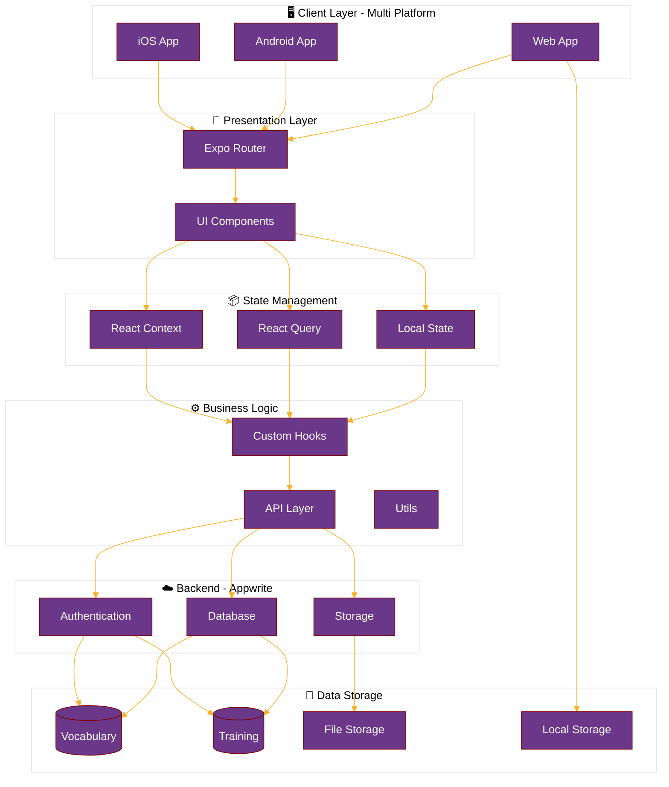
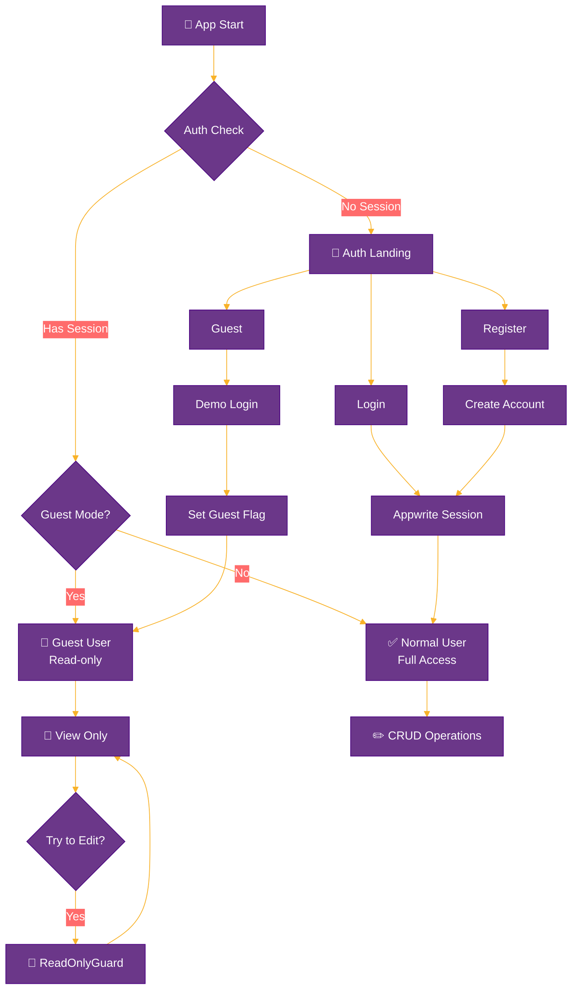
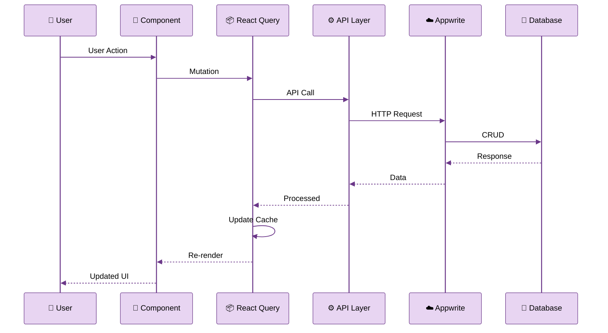
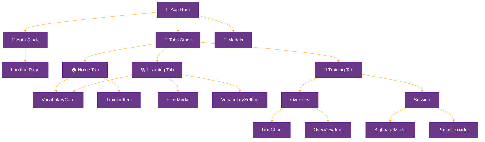
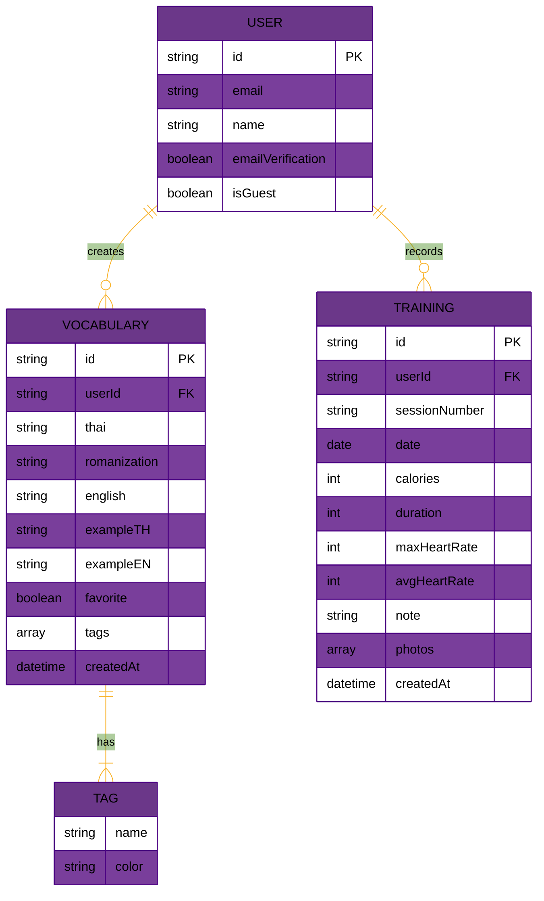

# MuayLang 🥊🇹🇭

> **⚠️ 開發中 | Work in Progress | 🚧 Under Development**
>
> 此項目目前正在積極開發中，功能可能不完整火發生變化。
>
> This project is currently under active development. Features may be incomplete or subject to change.

A mobile application for learning Thai language while tracking your Muay Thai training journey.

---

## 🚀 Development Status

| Feature                | Status         |
| ---------------------- | -------------- |
| Authentication         | ✅ Complete    |
| Vocabulary Management  | 🚧 In Progress |
| Training Tracker       | 🚧 In Progress |
| Data Visualization     | 🚧 In Progress |
| Text-to-Speech         | ✅ Complete    |
| Multi-language Support | 📋 Planned     |
| Offline Mode           | 📋 Planned     |

**Legend:** ✅ Complete | 🚧 In Progress | 📋 Planned

---

## 📱 Features

### Language Learning

- **Vocabulary Management**: Add, edit, and organize Thai vocabulary with romanization and English translations
- **Example Sentences**: Include example sentences for better context
- **Favorites System**: Mark important words for quick access
- **Smart Filtering**: Search and filter vocabulary by tags, favorites, or keywords
- **Text-to-Speech**: Listen to Thai pronunciation

### Training Tracker

- **Session Logging**: Record your Muay Thai training sessions
- **Metrics Tracking**:
  - Duration
  - Calories burned
  - Heart rate (max & average)
  - Session notes
  - Training photos
- **Visual Analytics**: Charts and statistics to track your progress
- **Weekly Overview**: See your training summary at a glance

## 🛠 Tech Stack

### Frontend

- **React Native** - Cross-platform mobile development
- **Expo** (~54.0.10) - Development framework and tooling
- **TypeScript** - Type-safe code
- **Expo Router** - File-based routing

### Styling

- **NativeWind** (v4) - Tailwind CSS for React Native
- **Gluestack UI** - Component library with Tailwind variants
- Custom theme with Muay Thai branding

### State Management & Data

- **TanStack Query** (React Query) - Server state management
- **Appwrite** - Backend as a Service (BaaS)
  - Authentication
  - Database
  - Storage

### UI/UX

- **React Native Reanimated** - Smooth animations
- **React Native Gesture Handler** - Touch interactions
- **Expo Image** - Optimized image loading
- **React Native Chart Kit** - Data visualization

## 📐 System Architecture

### Overall System Architecture



### Authentication Flow



### Data Flow Architecture



### Component Hierarchy



### Data Model



## 📦 Installation

### Prerequisites

- Node.js (v18 or higher)
- npm or yarn
- Expo CLI
- iOS Simulator (Mac) or Android Emulator

### Setup

1. Clone the repository:

```bash
git clone https://github.com/yourusername/MuayLang.git
cd MuayLang
```

2. Install dependencies:

```bash
npm install
```

3. Set up environment variables:
   Create a `.env` file in the root directory with your Appwrite configuration:

```env
EXPO_PUBLIC_APPWRITE_ENDPOINT=your_appwrite_endpoint
EXPO_PUBLIC_APPWRITE_PROJECT_ID=your_project_id
EXPO_PUBLIC_APPWRITE_DATABASE_ID=your_database_id
EXPO_PUBLIC_DEMO_USER_ID=your_demo_user_id  # Required for guest mode
```

⚠️ **Security Note**: Never commit your `.env` file to Git. See [SECURITY.md](./SECURITY.md) for details.

💡 **Guest Mode**: Without `EXPO_PUBLIC_DEMO_USER_ID`, guests will see empty data pages (safe for public repos).

4. Start the development server:

```bash
npm start
```

## 🚀 Available Scripts

```bash
npm start          # Start Expo development server
npm run android    # Run on Android device/emulator
npm run ios        # Run on iOS simulator
npm run web        # Run in web browser
npm run lint       # Run ESLint
npm run build      # Build for production (web)
```

## 📁 Project Structure

```
MuayLang/
├── app/                    # Expo Router pages
│   ├── (auth)/            # Authentication screens
│   │   ├── login.tsx
│   │   ├── register.tsx
│   │   └── index.tsx
│   ├── (tabs)/            # Main app tabs
│   │   ├── index.tsx      # Home
│   │   ├── learning.tsx   # Vocabulary
│   │   └── training.tsx   # Training log
│   ├── vocabulary/        # Vocabulary management
│   └── section/           # Training session management
├── components/            # Reusable components
│   ├── ui/               # UI component library
│   ├── learning/         # Learning-specific components
│   ├── training/         # Training-specific components
│   └── auth/             # Authentication components
├── constants/            # App constants and themes
├── hooks/                # Custom React hooks
├── lib/                  # API and Appwrite setup
├── utils/                # Utility functions
└── assets/               # Images and static files
```

## 🎨 Design System

### Colors

- **Primary Purple**: `#6B3789` (Muay Thai purple)
- **Accent White**: `#f9f7fa`
- Supports light/dark mode themes

### Typography

- Built-in font variants for different text styles
- Thai script support with proper line heights

## 🔐 Authentication

The app uses Appwrite for authentication with the following features:

- Email/Password registration and login
- Email verification
- Protected routes with guest/user-only wrappers
- Persistent sessions

## 🌐 API Integration

All API calls are handled through React Query with custom hooks:

- `useVocabularies()` - Fetch vocabulary list
- `useTraining()` - Fetch training sessions
- `useAddVocabulary()` - Add new vocabulary
- `useUpdateVocabulary()` - Update existing vocabulary
- And more...

## 📱 Platform Support

- ✅ iOS
- ✅ Android
- ✅ Web (limited features)

## ⚠️ Development Notes

### Known Issues

- Some UI components are still being optimized
- Database schema may change during development
- API endpoints are subject to modification

### Upcoming Features

- Advanced vocabulary filtering and sorting
- Training analytics dashboard
- Social features for sharing progress
- Custom training plans
- Voice recognition for pronunciation practice

## 🤝 Contributing

**Note:** As this project is in active development, the codebase may change frequently.

Contributions are welcome! Please feel free to submit a Pull Request.

## 📄 License

This project is private and proprietary.

## 👨‍💻 Author

**Ho47**

## 🙏 Acknowledgments

- Expo team for the amazing framework
- NativeWind for bringing Tailwind to React Native
- Gluestack UI for the component library
- Appwrite for the backend infrastructure

---

Made with ❤️ for Muay Thai enthusiasts and Thai language learners
